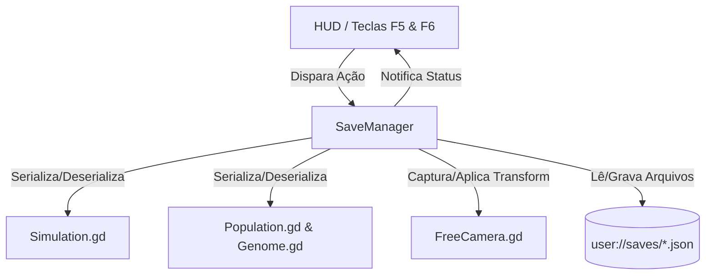

# 💾 Plano de Implementação: Sistema de Exportação e Importação (Save & Load)

Este documento descreve a arquitetura e as etapas para permitir que o usuário exporte e importe:
1. **O progresso genético completo** (geração atual, todos os genomas da população, fitness e recorde histórico de voltas).
2. **O melhor indivíduo isolado** (*Best Pilot Model*) para compartilhamento ou testes futuros.
3. **O estado da Câmera Livre** (posição 3D no espaço, ângulos de guinada/arfagem, velocidade configurada).
4. **Interface e Atalhos** para salvar/carregar com feedback visual na tela do jogo.

---

## 🎯 Objetivos Principais

* **Persistência Completa da Simulação**: Salvar o estado da neuroevolução para não perder gerações de treinamento ao fechar o jogo.
* **Persistência da Câmera**: Manter o ponto de observação e enquadramento preferido do usuário entre sessões.
* **Modelo Exportável do Melhor Carro**: Capacidade de salvar separadamente apenas o campeão da simulação (`best_genome.json`).
* **Usabilidade e Feedback**: Atalhos rápidos de teclado (`F5` para salvar, `F6` para carregar) e botões visuais no painel de telemetria (HUD) com mensagens de notificação (Toast).
* **Formato Aberto e Legível (JSON)**: Arquivos `.json` legíveis, permitindo backup e inspeção manual.

---

## 📐 Estrutura dos Dados (Schema JSON)

### 1. Checkpoint Geral da Simulação (`save_state.json`)
```json
{
  "version": 1,
  "timestamp": "2026-10-08T10:30:00",
  "simulation": {
    "generation": 12,
    "population_size": 10,
    "all_time_max_laps": 4,
    "genomes": [
      {
        "fitness": 2540.5,
        "genes": [0.124, -0.852, 0.441, "...(434 valores)..."]
      }
    ]
  },
  "camera": {
    "position": [-1.3, 2.5, 3.2],
    "yaw": 0.45,
    "pitch": -0.32,
    "base_speed": 15.0,
    "movement_mode": 0
  }
}
```

### 2. Melhor Modelo Individual (`best_pilot.json`)
```json
{
  "version": 1,
  "model_type": "RaceCar_Single_Genome",
  "generation": 12,
  "fitness": 2540.5,
  "gene_count": 434,
  "genes": [0.124, -0.852, 0.441, "..."]
}
```

---

## 🏗️ Arquitetura dos Componentes



---

## 📂 Alterações Propostas

### 1. `Scripts/Neural/Genome.gd`
* Adicionar métodos de conversão:
  * `to_dict() -> Dictionary`: Retorna dicionário com `fitness` e lista `genes`.
  * `static func from_dict(data: Dictionary) -> Genome`: Recria o genoma validando a contagem de 434 genes.

### 2. `Scripts/Evolution/Population.gd`
* Adicionar métodos:
  * `to_dict() -> Dictionary`: Serializa a lista completa de genomas e a geração.
  * `load_from_dict(data: Dictionary) -> void`: Reconstrói a população a partir dos dados importados.

### 3. `Scripts/FreeCamera.gd`
* Adicionar métodos de estado:
  * `get_camera_state() -> Dictionary`: Captura `global_position`, `_yaw`, `_pitch`, `base_speed`, `movement_mode`.
  * `set_camera_state(data: Dictionary) -> void`: Restaura a posição, orientação e parâmetros de navegação.

### 4. `Scripts/Simulation/SaveManager.gd` [NOVO]
* Gerenciador centralizado responsável por:
  * Garantir a criação do diretório `user://saves/`.
  * `save_simulation(filepath: String) -> bool`
  * `load_simulation(filepath: String) -> bool`
  * `save_best_pilot(filepath: String) -> bool`
  * `load_best_pilot_into_population(filepath: String) -> bool`: Preenche a população replicando e mutando o piloto campeão importado.

### 5. `Scripts/UI/HUD.gd`
* Adicionar botões no painel:
  * 💾 **Salvar [F5]**
  * 📂 **Carregar [F6]**
  * ⭐ **Exportar Campeão**
* Adicionar sistema de **Toast/Notificação**:
  * Mensagem temporária animada no topo/rodapé informando sucesso ou falha da operação (ex: *"✅ Simulação salva: Geração #12"*).

---

## 🔍 Plano de Verificação

### 1. Verificação Automatizada
* Checagem de compilação com `godot --headless --check-only` em todos os scripts modificados e novos.
* Teste de inicialização headless com o motor Godot 4.

### 2. Verificação Funcional
1. Iniciar a simulação e deixar rodar por 2 ou 3 gerações.
2. Mover a câmera livre para uma posição e ângulo específicos.
3. Pressionar `F5` (ou clicar em Salvar) e verificar a notificação na tela e a criação do arquivo em `user://saves/quicksave.json`.
4. Fechar ou reiniciar a cena (Geração volta a 0, câmera volta ao padrão).
5. Pressionar `F6` (ou clicar em Carregar) e verificar:
   - A geração é restaurada exatamente para o número salvo.
   - A câmera salta imediatamente para a posição e ângulo salvos.
   - Os carros continuam evoluindo a partir daquele ponto.
6. Testar o botão "Exportar Campeão" e verificar a geração de `best_pilot.json`.

---

## 💬 Perguntas e Opções para o Usuário

1. **Local de Salvamento Padrão**:
   * O padrão do Godot para arquivos graváveis é a pasta `user://saves/` (que no macOS fica em `~/Library/Application Support/Godot/app_userdata/race-ai/saves/`).
   * Também é possível gravar diretamente na pasta do projeto (`res://saves/`). 
   * **Recomendação**: Usar `user://saves/` com atalho/opção para exportar para `res://saves/` se desejado.
2. **Atalhos de Teclado**:
   * `F5`: Salvar Rápido (Quick Save).
   * `F6`: Carregar Rápido (Quick Load).
   * Deseja manter esses atalhos ou prefere outras teclas?
