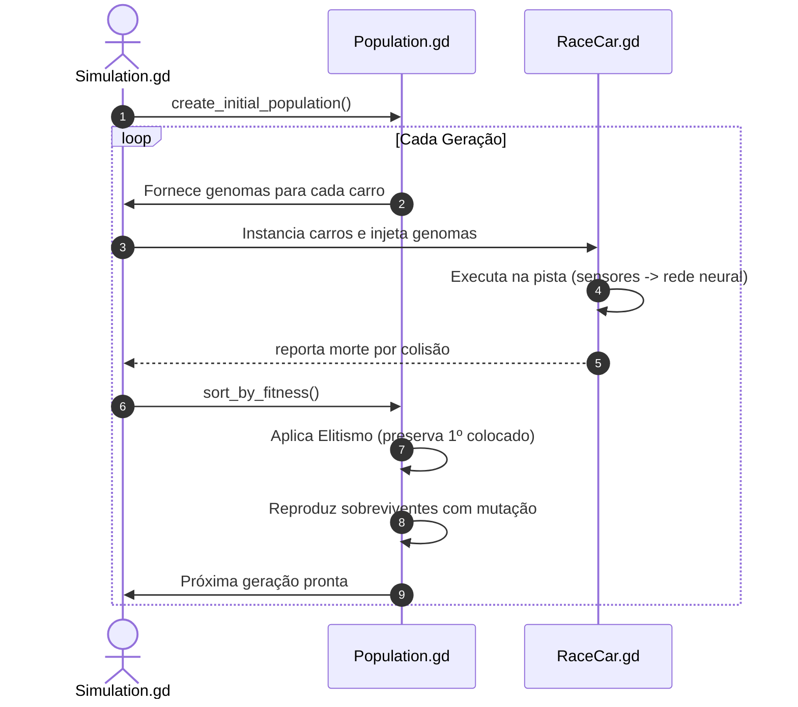

# 🧬 Genomas e Algoritmo Genético

O módulo de evolução do projeto é responsável por gerenciar a reprodução, mutação e seleção natural dos veículos na simulação. Ele é implementado principalmente em [Genome.gd](file:///Users/samukadev/Documents/Godot%20Projects/race-ai/Scripts/Neural/Genome.gd), [Population.gd](file:///Users/samukadev/Documents/Godot%20Projects/race-ai/Scripts/Evolution/Population.gd) e orquestrado por [Simulation.gd](file:///Users/samukadev/Documents/Godot%20Projects/race-ai/Scripts/Simulation/Simulation.gd).

---

## 🔬 O Que é o Genoma (`Genome.gd`)

Um indivíduo na simulação é inteiramente representado por seu **Genótipo** (conjunto de genes). No Race-AI, o genoma é um vetor contínuo de números de ponto flutuante:

```gdscript
class_name Genome
extends RefCounted

const GENE_COUNT: int = 434
var genes: PackedFloat32Array
var fitness: float = 0.0
```

### Por que 434 genes?
Cada gene corresponde diretamente a um parâmetro de peso sináptico ou bias da rede neural do carro:

$$\text{Total} = (7 \times 16 + 16) + (16 \times 16 + 16) + (16 \times 2 + 2) = 128 + 272 + 34 = 434$$

* **Inicialização**: Valores aleatórios no intervalo $[-1.0, 1.0]$.
* **Representação**: Ponto flutuante contínuo de 32 bits (`PackedFloat32Array`) para alta performance e baixo consumo de memória.

---

## ⚙️ Operadores Genéticos

### 1. Mutação (`mutate`)
Modifica levemente o valor de alguns genes, introduzindo diversidade e permitindo descobrir novas estratégias de direção:

```gdscript
func mutate(rate: float = 0.05, strength: float = 0.2) -> void:
    for i in range(GENE_COUNT):
        if randf() < rate:
            genes[i] += randfn(0.0, strength)
```

* **Taxa de Mutação (`rate = 0.05`)**: 5% de chance de cada gene individual sofrer alteração.
* **Força da Mutação (`strength = 0.2`)**: Variação sorteada por uma distribuição normal gaussiana (`randfn(0.0, strength)`), garantindo que a maioria das alterações sejam pequenas e suaves, evitando saltos destrutivos no comportamento.

### 2. Crossover / Recombinação (`crossover`)
Cria um novo indivíduo combinando os genes de dois progenitores:

```gdscript
func crossover(other: Genome) -> Genome:
    var child: Genome = Genome.new()
    for i in range(GENE_COUNT):
        if randf() < 0.5:
            child.genes[i] = genes[i]
        else:
            child.genes[i] = other.genes[i]
    return child
```

* Utiliza recombinação uniforme: para cada um dos 434 genes, há 50% de chance de herdar o gene do primeiro progenitor e 50% de chance do segundo.

---

## 👥 População e Ciclo de Vida (`Population.gd`)

A classe `Population` gerencia a geração atual de indivíduos e o avanço geracional:



### 1. Função de Aptidão (Fitness)
A métrica de sucesso é a distância percorrida pelo veículo ao longo do circuito:

$$\text{Fitness} = \text{distance\_traveled}$$

Carros que colidem cedo acumulam pontuações menores. Carros que conseguem contornar curvas e se manter na pista acumulam valores maiores de fitness.

### 2. Elitismo
Para garantir que a evolução nunca regrida, o melhor genoma da geração é preservado de forma idêntica:

```gdscript
# Mantém o melhor indivíduo intacto
next_generation.append(survivors[0].copy())
```

### 3. Seleção dos Sobreviventes
* A população é ordenada de forma decrescente com base no fitness.
* Os melhores 50% da população (`survivors_count = population_size / 2`) são selecionados como a base reprodutiva da próxima geração.
* O restante das vagas é preenchido clonando sobreviventes aleatórios com aplicação de mutação gaussiana.
