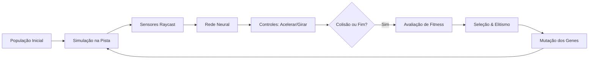

# 🏎️ Race-AI — Visão Geral do Projeto

**Race-AI** é um projeto de simulação 3D desenvolvido no **Godot Engine 4** com o motor de física **Jolt Physics**, cujo objetivo é treinar veículos autônomos de corrida para pilotarem em pistas complexas através de **Algoritmos Genéticos** combinados com **Redes Neurais Artificiais (Neuroevolução)**.

---

## 🎯 Objetivo

Eliminar a necessidade de regras manuais ou programação tradicional de direção. Os carros começam sem conhecimento prévio da pista e, geração após geração, aprendem por tentativa e erro:
1. Ler os dados do ambiente através de sensores (raycasts).
2. Processar esses dados através de uma rede neural artificial própria.
3. Tomar decisões em tempo real de aceleração, frenagem e esterçamento do volante.
4. Evoluir geneticamente, preservando os melhores indivíduos (elitismo) e aplicando mutações nas novas gerações.

---

## 🏗️ Arquitetura do Sistema

O projeto é dividido em quatro subsistemas principais:

### 1. Física e Controle do Veículo (`RaceCar.gd`)
* Cada carro é um nó `CharacterBody3D` que simula física de aceleração, frenagem, atrito e rotação de direção proporcional à velocidade atual.
* Possui colisor 3D e detecta impactos contra elementos identificados no grupo `"track_obstacle"`.
* Ao colidir, o carro morre (`die()`), para de se mover, tem sua cor alterada para cinza e o texto atualizado para `"Dead"`.

### 2. Sistema Sensorial (`CarSensors.gd`)
* 5 sensores do tipo raycast dispostos em leque na frente do veículo (`-45°`, `-22.5°`, `0°`, `+22.5°`, `+45°`).
* Detectam a proximidade de guard-rails, barreiras e bordas da pista.
* Sistema integrado de depuração visual com `ImmediateMesh`, ativável em tempo real pressionando a tecla `F3`.

### 3. Cérebro Neural (`NeuralNetwork.gd` & `Layer.gd`)
* Rede neural feedforward multicamadas (MLP).
* Topologia: **7 entradas**, **16 neurônios ocultos (Layer 1)**, **16 neurônios ocultos (Layer 2)** e **2 saídas**.
* Total de **434 parâmetros** (pesos sinápticos + vieses/biases).
* Função de ativação tangencial hiperbólica (`tanh`), fornecendo respostas no intervalo `[-1.0, 1.0]`.

### 4. Ciclo Evolutivo (`Population.gd` & `Genome.gd` & `Simulation.gd`)
* **Genoma**: Vetor de 434 números reais (`PackedFloat32Array`), onde cada gene mapeia diretamente um peso ou bias da rede neural.
* **Fitness**: Avaliado com base na distância percorrida pelo veículo ao longo da pista (`distance_traveled`).
* **Seleção & Elitismo**: O melhor piloto de cada geração passa inalterado para a próxima geração.
* **Mutação**: Sorteio gaussiano de pequenas alterações nos pesos com taxa e força ajustáveis.

---

## 🕹️ Câmera Livre (`FreeCamera.gd`)

Para permitir ao usuário inspecionar qualquer ângulo do circuito e acompanhar a evolução dos veículos, foi integrado um componente de câmera livre com suporte a:
* Voo 3D contínuo ou navegação planar no plano horizontal.
* Controle intuitivo via mouse (botão direito ou modo FPS capturado).
* Controles clássicos `WASD`, `Shift` (descer) e `Espaço` (subir).

---

## 📚 Documentações Detalhadas

Para se aprofundar em cada módulo do projeto, consulte os documentos dedicados na pasta `docs/`:

* [Genomas e Algoritmo Genético](file:///Users/samukadev/Documents/Godot%20Projects/race-ai/docs/genomes_evolution.md)
* [Rede Neural Artificial](file:///Users/samukadev/Documents/Godot%20Projects/race-ai/docs/neural_network.md)
* [Veículos e Sensores de Proximidade](file:///Users/samukadev/Documents/Godot%20Projects/race-ai/docs/car_sensors.md)
* [Câmera Livre (FreeCamera)](file:///Users/samukadev/Documents/Godot%20Projects/race-ai/docs/free_camera.md)
* [Estrutura de Pastas e Arquivos](file:///Users/samukadev/Documents/Godot%20Projects/race-ai/docs/project_structure.md)
