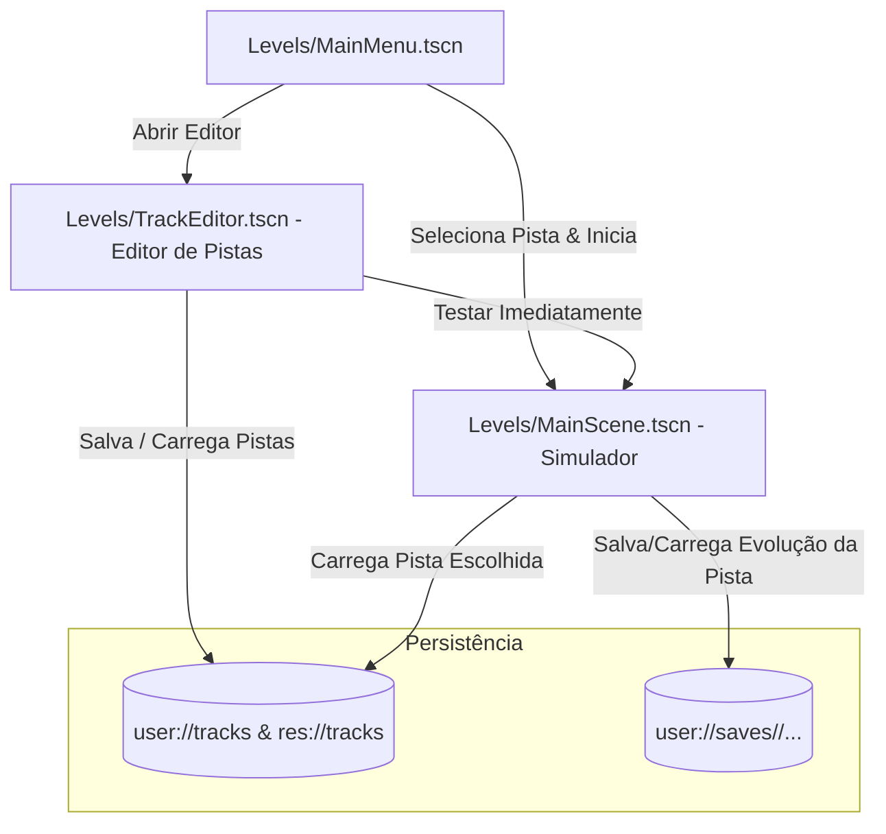

# 🏁 Plano de Implementação: Editor de Pistas & Menu Principal com Saves Isolados por Pista

Este plano detalha o desenvolvimento do **Editor de Pistas 3D**, do **Menu Principal**, do carregamento dinâmico de circuitos no simulador e do **isolamento de dados evolutivos e genomas por pista**.

---

## 🎯 Objetivos do Projeto

1. **Menu Principal (`Levels/MainMenu.tscn`)**:
   * Ponto de entrada do jogo.
   * Navegação entre o **Simulador de IA** (com seletor de pista) e o **Editor de Pistas**.
   * Estrutura modular preparada para futuras telas (edição de sensores, redes neurais, etc.).
2. **Editor de Pistas 3D (`Levels/TrackEditor.tscn`)**:
   * Interface interativa de construção de pistas em grade 3D.
   * Paleta visual com peças modulares da Kenney Racing Kit (Retas, Curvas Grandes/Pequenas, Largadas, Chicanes).
   * Visualização com cursor fantasma (*Ghost Preview*), rotação por atalho (`R`) e snap de grade.
   * Sistema de colocação de peças, remoção com botão direito e marcação de checkpoints.
   * Salvar e carregar pistas em formato JSON legível (`user://tracks/<nome>.json` e `res://tracks/<nome>.json`).
3. **Simulador com Pistas Dinâmicas (`MainScene.tscn`)**:
   * O circuito deixa de ser estático e passa a ser instanciado em tempo de execução com base na pista escolhida.
   * A pista padrão atual da `MainScene.tscn` será preservada e catalogada como `default_circuit.json`.
4. **Isolamento de Saves por Pista (`SaveManager.gd`)**:
   * Cada pista possui seu próprio subdiretório de evolução (`user://saves/<track_id>/...`).
   * Genomas e recordes de uma pista nunca sobrescrevem ou interferem nos de outra.
5. **Correção de Colisão dos Sensores (`Sensors.gd`)**:
   * Adicionar máscara de colisão (`collision_mask = 1`) para evitar que raios colidam com outros carros.

---

## 🏗️ Arquitetura e Fluxo do Sistema



---

## 📐 Estrutura de Dados das Pistas (JSON)

Arquivo salvo em `user://tracks/<track_id>.json` e `res://tracks/<track_id>.json`:

```json
{
  "track_id": "circuito_interlagos",
  "track_name": "Circuito Interlagos",
  "created_at": "2026-10-08T15:00:00",
  "grid_size": 1.0,
  "spawn_point": {
    "position": [0.35, 0.3, 0.25],
    "rotation_y_deg": 0.0
  },
  "pieces": [
    {
      "piece_id": "RoadStart",
      "position": [1.0, 0.0, 4.0],
      "rotation_y_deg": 180.0
    },
    {
      "piece_id": "RoadStraight",
      "position": [0.0, 0.0, 7.0],
      "rotation_y_deg": 0.0
    },
    {
      "piece_id": "RoadCornerLarge",
      "position": [1.0, 0.0, 7.0],
      "rotation_y_deg": -90.0
    }
  ],
  "checkpoints": [
    { "position": [4.0, 0.5, 9.0], "size": [3.0, 2.0, 1.5] },
    { "position": [7.0, 0.5, 2.5], "size": [1.5, 2.0, 3.0] },
    { "position": [0.0, 0.5, -1.0], "size": [3.0, 2.0, 1.5] },
    { "position": [0.5, 0.5, 4.0], "size": [3.0, 2.0, 1.5] }
  ]
}
```

---

## 🗂️ Estrutura de Pastas de Saves por Pista

```
user://saves/
├── default_circuit/
│   ├── quicksave.json      # Snapshot completo da IA nesta pista
│   └── best_pilot.json     # Melhor modelo treinado nesta pista
├── circuito_oval/
│   ├── quicksave.json
│   └── best_pilot.json
└── minha_pista_nova/
    ├── quicksave.json
    └── best_pilot.json
```

---

## 🔨 Componentes a Serem Desenvolvidos

### 1. Autoload Global (`Scripts/Global/AppState.gd`)
* Gerencia o estado entre cenas:
  * `current_track_id: String = "default_circuit"`
  * `is_custom_track: bool = false`
  * `track_data_to_test: Dictionary = {}`

### 2. Catálogo de Peças Modulares (`Scripts/Track/TrackCatalog.gd`)
* Mapeamento de identificadores de peças para seus arquivos `.tscn`:
  * `"RoadStraight"` $\rightarrow$ `res://Models/Roads/RoadStraight.tscn`
  * `"RoadStraightLong"` $\rightarrow$ `res://Models/Roads/RoadStraightLong.tscn`
  * `"RoadCornerLarge"` $\rightarrow$ `res://Models/Roads/RoadCornerLarge.tscn`
  * `"RoadCornerSmall"` $\rightarrow$ `res://Models/Roads/RoadCornerSmall.tscn`
  * `"RoadStart"` $\rightarrow$ `res://Models/Roads/RoadStart.tscn`
  * `"RoadStartPositions"` $\rightarrow$ `res://Models/Roads/RoadStartPositions.tscn`
  * Suporte a expansão para barreiras, pontes, cones e chicanes.

### 3. Gerenciador de Pistas (`Scripts/Track/TrackManager.gd`)
* Métodos:
  * `load_track_from_dict(data: Dictionary) -> void`: Instancia as peças e os checkpoints dinamicamente.
  * `clear_track() -> void`: Remove peças instanciadas.
  * `save_current_track_to_file(path: String) -> bool`
  * `load_track_from_file(path: String) -> Dictionary`

### 4. Menu Principal (`Levels/MainMenu.tscn` & `Scripts/UI/MainMenu.gd`)
* Design refinado com tema escuro e glassmorphism:
  * 🏁 Título animado: **RACE-AI**
  * Botão **"🏎️ Iniciar Simulação"**: Abre seletor com lista de pistas salvas e botão de iniciar.
  * Botão **"🛠️ Editor de Pistas"**: Transiciona para o editor de pistas.
  * Botão **"⚙️ Configurações"**: Modal preparado para futuras configurações.
  * Botão **"❌ Sair"**

### 5. Editor de Pistas (`Levels/TrackEditor.tscn` & `Scripts/TrackEditor/TrackEditor.gd`)
* **Câmera do Editor**: Voo livre com WASD + Mouse ou visão aérea tática com zoom.
* **Raycast no Chão 3D**: Projeta raio do mouse na superfície `Y = 0` para obter coordenada de posicionamento com snap em `1.0m`.
* **Peça Fantasma (Ghost Preview)**: Exibe a peça translúcida selecionada na posição do mouse. Pressionar `R` rotaciona em 90°.
* **Ações**:
  * Clique Esquerdo: Instancia a peça selecionada na coordenada.
  * Clique Direito: Remove a peça sob o cursor.
  * Teclas 1-9 ou botões na paleta: Troca a peça ativa.
* **Interface do Editor**:
  * Paleta de peças com botões visuais.
  * Campo de texto para nome da pista.
  * Botões "Salvar Pista", "Carregar", "Limpar", "Testar no Simulador" e "Menu Principal".

### 6. Atualização do `SaveManager.gd`
* Adaptação para usar caminhos particionados:
  `user://saves/<AppState.current_track_id>/quicksave.json`
* Suporte a criar a pasta automaticamente para cada pista.

### 7. Correção no `Sensors.gd`
* Garantir `query.collision_mask = sensor_collision_mask` (valor padrão 1) no `cast_sensor`.

---

## 🔍 Plano de Verificação

### 1. Verificação Automatizada
* Checagem com `godot --headless --check-only` em todos os scripts novos e modificados.
* Validação de sintaxe e dependências cruzadas.

### 2. Verificação Manual / Funcional
1. **Menu Principal**: Iniciar a aplicação e verificar se a cena abre em `MainMenu.tscn`.
2. **Editor de Pistas**: Clicar em "Editor de Pistas" e verificar:
   - Movimentação de câmera.
   - Posicionamento de peças na grade com clique esquerdo.
   - Rotação com tecla `R`.
   - Remoção com clique direito.
   - Salvar a pista com um nome personalizado.
3. **Carregamento no Simulador**: Clicar em "Testar na Simulação" ou iniciar a pista salva pelo Menu Principal.
   - Verificar se os carros nascem na largada da pista personalizada.
   - Verificar se os checkpoints funcionam e registram voltas.
4. **Isolamento de Saves**: Salvar o progresso na pista criada e verificar se foi gerado o arquivo em `user://saves/<nome_da_pista>/quicksave.json` sem interferir na pista padrão.
